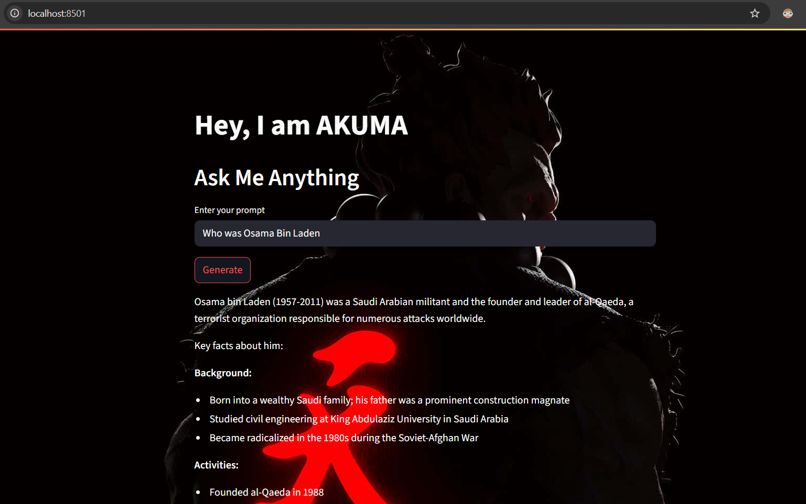

# Akuma One Shot

Akuma AI is a **simple single-prompt text generation tool** powered by **Hugging Face LLMs**.  
You type a prompt, Akuma gives an AI-generated response—no chat history, no memory, just clean and simple AI responses.  

This was my first experiment with Hugging Face APIs, making it a great **starter project** for anyone exploring LLMs.

---

## 🚀 Features
- ✍️ Enter a prompt and get an AI-generated response
- ⚡ Powered by Hugging Face's `Qwen3-Coder-480B-A35B-Instruct` model
- 🎨 Custom UI with background image styling
- 🧩 Minimal setup—great for beginners

---

## 🛠️ Tech Stack
- **Python**
- **Streamlit**
- **LangChain**
- **Hugging Face Hub**

---

## ⚙️ Installation & Setup

### 1️⃣ Clone the repository
```bash
git clone https://github.com/Arsalan692/Akuma-One-Shot
cd Akuma-One-Shot
```

### 2️⃣ Create a virtual environment (optional but recommended)
```bash
python -m venv venv
source venv/bin/activate   # For Linux/Mac
venv\Scripts\activate      # For Windows
```

### 3️⃣ Install dependencies
```bash
pip install -r requirements.txt
```
### 4️⃣ Set up API key
**🔑 Setting Up Hugging Face API Key**
- Go to **Hugging Face** and sign up for a free account: https://huggingface.co/
- After logging in, go to **Settings > Access Tokens**
- Click New Token, give it a name and choose Read permission.
- Copy the generated token.

### 5️⃣ Add API Key
**Create a .env file in the project root and add your key:**
```bash
# HUGGINGFACE API KEY
HUGGINGFACEHUB_API_TOKEN=your_token_here
```

### 6️⃣ Run the app
```bash
streamlit run akuma-one-shot.py
```
---

## 📸 Demo Screenshot
<p align="center">
  
</p>
